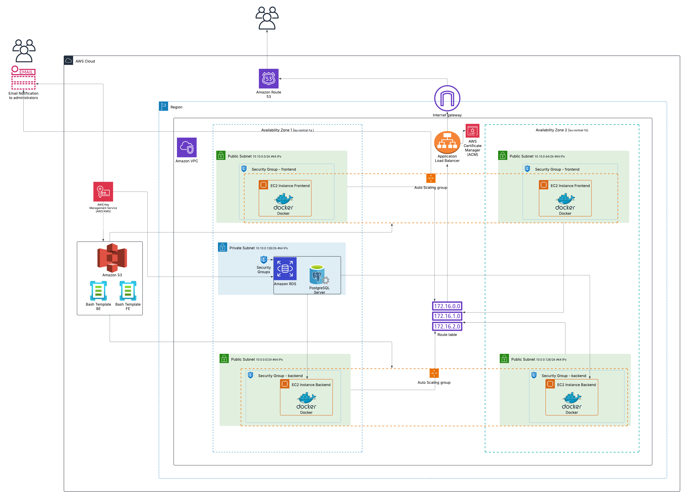
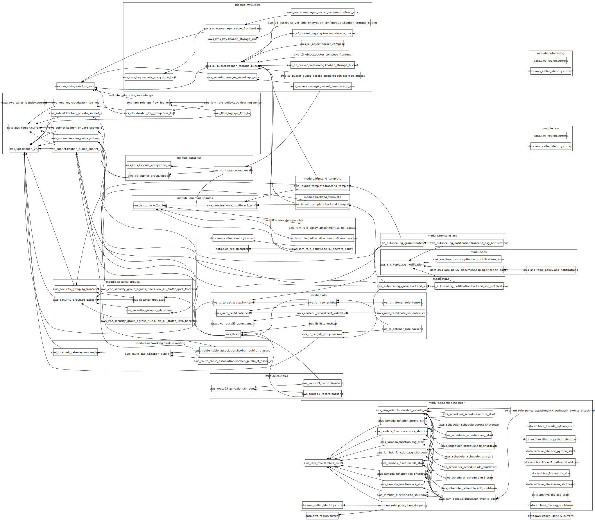

# **Kooben AWS Infrastructure - Terraform Deployment**

## **📌 Overview**
This repository contains the infrastructure configuration for the **Kooben** project using **Terraform**. It is designed to deploy a complete AWS-based architecture for a carpentry business application, consisting of:

- **Backend**: Built with NestJS, containerized with Docker
- **Frontend**: Built with NextJS, containerized with Docker
- **Complete Infrastructure**: VPC, subnets, security groups, load balancers, auto-scaling groups, RDS, and more

**Related Repositories (Work in Progress):**
- **Frontend Repository**: [kooben-fe](https://github.com/thusspokedata/kooben-fe) - NextJS e-commerce application (WIP)
- **Backend Repository**: [kooben-be](https://github.com/thusspokedata/kooben-be) - NestJS API for the application (WIP)

The key philosophy behind this project is **Infrastructure as Code (IaC)** with approximately 98% of the infrastructure created and managed through Terraform and Terraform Cloud, minimizing the need for AWS Console interaction. Docker images are pulled directly from Docker Hub when EC2 instances are provisioned, using a bash script embedded in the Launch Template.


## **🧠 Project Philosophy**
The core principles guiding this project:

1. **Complete Terraform Automation**: Minimize AWS Console interaction, ensuring reproducible deployments
2. **Modular Design**: Well-structured code divided into logical modules for maintainability
3. **Security First**: Utilizing tools like tfsec to identify and address security concerns
4. **Cost Optimization**: Implementing scheduling for non-production resources to reduce costs
5. **Documentation**: Comprehensive documentation for future reference and learning
6. **Continuous Improvement**: A platform for learning and evolving better design patterns

The only manual interactions required with AWS were creating secret keys in AWS Secrets Manager and copying Route53 DNS records to configure in Namecheap domain settings.

## **🏗️ Infrastructure Visualization**
The project includes visual representations of the infrastructure deployed with Terraform:

### Detailed Architecture Diagram


This detailed diagram shows the AWS architecture with a clear representation of the different availability zones, subnets, and services used in the project. It provides a comprehensive view of how the components interact within the AWS Cloud.

### Terraform Resource Graph


This automatically generated diagram shows the relationships between Terraform resources and the overall architecture of the system. It represents all the AWS resources and their connections as defined in the Terraform code. 😬 The graph might look a bit chaotic due to the complex relationships between resources, but it provides valuable insights into the infrastructure dependencies.

- **Locations**: 
  - Cloud Architecture: `documentation/Cloud-Architecture.png`
  - Terraform Graph: `documentation/graph.svg`
- **How to update the graph**: Run `terraform graph | dot -Tsvg > documentation/graph.svg` from the `infra` directory
- **Requirements**: GraphViz must be installed (`brew install graphviz` on macOS)

## **🛠️ Tools and Practices**
This project leverages several tools and best practices:

- **terraform fmt**: For consistent code formatting
- **tflint**: To catch errors and enforce best practices before applying changes
- **tfsec**: To identify potential security issues in Terraform configurations
- **infracost**: To estimate the monthly cost of AWS resources
- **External modules**:
  - Custom fork of EC2/RDS scheduler module for Auto Scaling Groups, EC2 and RDS instances ([terraform-aws-ec2-rds-scheduler](https://github.com/thusspokedata/terraform-aws-ec2-rds-scheduler)) (fixed security issues)
  - Random module for generating unique S3 bucket names
- **Security**: KMS for encryption, IAM for access management, VPC for network isolation
- **Secrets Management**: AWS Secrets Manager for sensitive application configuration

---

## **🛠 Project Structure**
```
.
├── infra/                      # Terraform infrastructure files
│   ├── modules/                # Terraform modules
│   │   ├── alb/                # Application Load Balancer module
│   │   │   ├── main.tf
│   │   │   ├── outputs.tf
│   │   │   ├── variables.tf
│   │   ├── backend/            # Backend application modules
│   │   │   ├── asg/            # Auto Scaling Group for backend
│   │   │   ├── launch_template/# Launch Template for backend
│   │   ├── frontend/           # Frontend application modules
│   │   │   ├── asg/            # Auto Scaling Group for frontend
│   │   │   ├── launch_template/# Launch Template for frontend
│   │   ├── iam/                # IAM configurations
│   │   ├── networking/         # Networking-related modules
│   │   │   ├── main.tf
│   │   │   ├── outputs.tf
│   │   │   ├── variables.tf
│   │   ├── rds/                # RDS database module
│   │   ├── route53/            # Route53 DNS configurations
│   │   ├── S3/                 # S3 Bucket module
│   │   ├── security_groups/    # Security Groups module
│   │   ├── sns/                # SNS notifications module
│   │   ├── kms/                # KMS module for encryption
│   │   │   ├── main.tf
│   │   ├── launch_template/     # EC2 Launch Template module
│   │   │   ├── main.tf
│   │   │   ├── user_data.sh     # Script for EC2 user data
│   │   │   ├── variables.tf
│   │   ├── networking/          # Networking-related modules
│   │   │   ├── modules/         # Submodules inside networking
│   │   │   │   ├── flow_logs/   # VPC Flow Logs module
│   │   │   │   │   ├── main.tf
│   │   │   │   │   ├── outputs.tf
│   │   │   │   │   ├── variables.tf
│   │   │   │   ├── routing/     # Routing-related configurations
│   │   │   │   │   ├── main.tf
│   │   │   │   │   ├── variables.tf
│   │   │   │   ├── vpc/         # VPC module
│   │   │   │   │   ├── main.tf
│   │   │   │   │   ├── outputs.tf
│   │   │   │   │   ├── variables.tf
│   │   ├── files/               # Files module, contains extra configurations
│   │   │   ├── docker-compose.yml
│   │   │   ├── main.tf
│   │   │   ├── output.tf
│   │   │   ├── variables.tf
│   ├── locals.tf                # Local variables for Terraform
│   ├── main.tf                 # Main entry point for Terraform
│   ├── outputs.tf               # Terraform output definitions
│   ├── providers.tf             # Terraform provider configurations
│   ├── terraform.tfvars         # Environment-specific variables (not committed)
│   ├── variables.tf             # Variable definitions
├── .gitignore                     # Files ignored by Git
├── README.md                      # Project documentation
├── documentation/                  # Project documentation folder
│   ├── s3.md                      # Documentation for S3 configuration
│   ├── COMMANDS.md                # List of useful Terraform commands
│   ├── graph.svg                  # Infrastructure visualization
│   ├── tools-i-used/              # Documentation for tools used
│   │   ├── infracost.md           # Infracost documentation
│   │   ├── tfenv.md               # tfenv documentation
│   │   ├── tfsec.md               # tfsec documentation
│   │   ├── tflint.md              # tflint documentation
```

---

## **🚀 Getting Started**
### **1️⃣ Prerequisites**
Ensure you have the following installed:
- [Terraform](https://developer.hashicorp.com/terraform/downloads)
- [AWS CLI](https://aws.amazon.com/cli/)
- [tfenv](https://github.com/tfutils/tfenv) (for managing Terraform versions) ([Documentation](documentacion/tools-i-used/tfenv.md))
- [TFLint](https://github.com/terraform-linters/tflint) (for linting) ([Documentation](documentacion/tools-i-used/tflint.md))
- [Infracost](https://www.infracost.io/) (for cost estimation) ([Documentation](documentacion/tools-i-used/infracost.md))
- [tfsec](https://aquasecurity.github.io/tfsec/) (for security analysis) ([Documentation](documentacion/tools-i-used/tfsec.md))

### **2️⃣ Setting Up Terraform**
```bash
# Install and use the correct Terraform version
tfenv install 1.10.5  
tfenv use 1.10.5      
terraform init        # Initialize Terraform
terraform validate    # Validate Terraform configuration
terraform plan        # Preview changes
terraform apply       # Apply changes to AWS
```

### **3️⃣ Running Security and Cost Analysis**
```bash
infracost breakdown --path ./infra  # Cost estimation
tflint                              # Run Terraform Linter to check for best practices
tfsec                               # Perform security analysis on Terraform configuration
```

---

## **🔗 Useful Links**
- [Terraform Documentation](https://developer.hashicorp.com/terraform/docs)
- [AWS CLI Documentation](https://docs.aws.amazon.com/cli/latest/userguide/cli-configure-quickstart.html)
- [Infracost Documentation](documentacion/tools-i-used/infracost.md)
- [TFLint Documentation](documentacion/tools-i-used/tflint.md)
- [tfenv Documentation](documentacion/tools-i-used/tfenv.md)
- [tfsec Documentation](documentacion/tools-i-used/tfsec.md)
- [S3 Configuration Documentation](documentacion/s3.md)
- [Project Presentation Slides](https://docs.google.com/presentation/d/1RDNLnNYJwPCziuKn04LqG9FRlSdY0I6O5hrQIT_auRE/edit?usp=sharing)

## **📌 Next Steps**
- Configure Launch Templates for backend instance ✅
- Implement cost optimization through scheduling ✅
- Deploy new services (EC2-backend, EC2-frontend, RDS) ✅
- Integrate Route 53 for domain management ✅
- Create Auto Scaling Group for dynamic scaling ✅
- Configure Launch Templates for frontend instance ✅
- Deploy an Application Load Balancer (ALB) ✅
- Implement HTTPS with AWS Certificate Manager ✅
- Implement monitoring (CloudWatch, CloudTrail)
- Automate CI/CD for Terraform deployments
- Migrate from Docker Hub to Amazon ECR for container registry
- Implement AWS native automation tools (CodePipeline, CodeBuild, CodeDeploy)
- Explore AWS container management services (ECS/EKS) for improved orchestration

---

## **💭 Personal Note**

I'm incredibly proud of what has been accomplished with this project. It represents countless hours of learning, troubleshooting, and refining. Working with Terraform and Terraform Cloud has been a revelation - these tools have fundamentally changed how I approach infrastructure development.

The ability to create and destroy complex infrastructure within seconds, without having to manually click through the AWS Management Console, has accelerated my learning process immensely. It's empowering to describe infrastructure as code and watch it come to life through automation.

This project is just the beginning. As I continue to gain experience, I plan to refine this codebase, implement more AWS-native services, and incorporate more sophisticated patterns and practices. The modular structure I've established provides a solid foundation for future improvements.

Happy coding!
